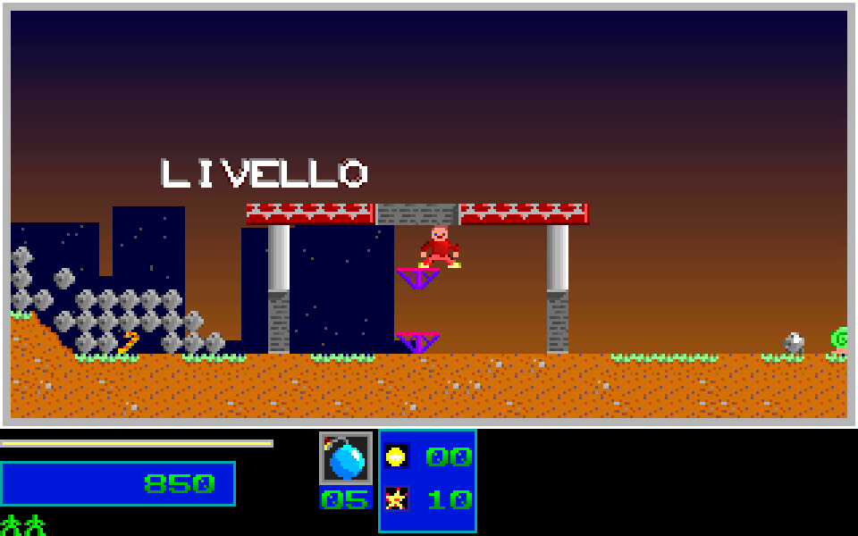
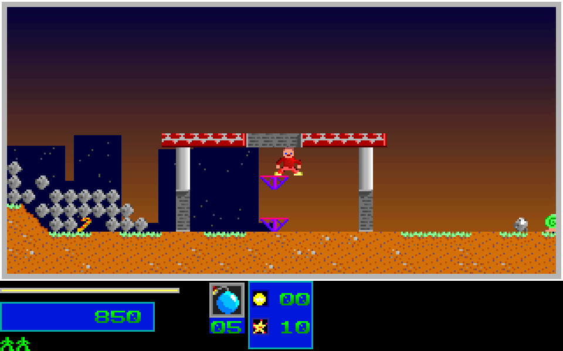

# Level 1 Completion Gate Recovery

This closes an observed early-results bug on an ordinary-input Level 1 route.
It does not close the natural results-to-Level-2 handoff or whole-game recovery.
Global `original_fidelity_claim` and `port_functionally_complete` remain false.

## Original Observation

The independently captured original bundle is
`tests/fixtures/level1_original/completion_gate/`. Its 308 route ticks contain
305 gameplay samples, following the existing three-tick startup prelude.
Each sample retains raw pre-presentation, rendered, and post-actor state, plus
the actual full 320x200 RGB frame. No crop or palette replacement is used.

The route uses the normal one-player start, movement, jump, two weapon-switch
chords, one large bomb, and retreat. Initial reserves and ammunition are not
increased. The only controlled state seed is the existing initial RNG seed
305441741. During gameplay the observer injects normalized control-bank input;
it does not teleport players or write health, ammunition, map damage, objective
counters, targets, or completion flags. This is instrumented original evidence,
not physical-key or uninstrumented wall-clock evidence. Audio is dummy throughout.

The complete original capture has a validated terminal record and restored
instrumentation. The observer source is unchanged. Identity pins are:

- Capture source SHA256: `f1797c57fe6363f9e189fb2ab0b9c76d32b5d2f46305458e2ba513b1d7d18758`.
- Compressed original stream SHA256: `7f7be9ea93c980a9ae8cac9d291938ca5eb10c7934f606f53dd457409b4c7180`.
- Canonical observations SHA256: `18c029dcc107cf95b088a914cf60aa05fd30fbaf26501e3b2367ee91cd96ace8`.

## Recovered Boundaries

Route tick is three greater than the original gameplay frame word.

| Route tick | Frame word | Destroyed | Displayed percent | Bonus/destruction flags | Collapse queue |
| --- | --- | --- | --- | --- | --- |
| 273 | 270 | 34 | 40 | 1 / 0 | 3 |
| 300 | 297 | 34 | 40 | 1 / 0 | 3 |
| 303 | 300 | 34 | 51 | 1 / 1 | 3 |
| 307 | 304 | 34 | 51 | 1 / 1 | 2 |
| 308 | 305 | 34 | 51 | 1 / 1 | 0 |

The original does not enter results when the raw destruction ratio first
crosses the target. Its displayed destruction percentage is sampled every
30 low-word frames. The HUD helper at `1000:3184` latches `DS:79C5` and
`DS:79C6` when the respective dirty objective display reaches its target.
Those flags persist until level reset.

The caller at `1000:79E8..7A00` invokes that helper only when the collected
count or cached percentage changes. Inside that invocation, `1000:325B`
requests border palette index 224 when both flags are set. Repeating the
request on every gameplay tick would incorrectly restart its fade. The native
two-entry palette queue can refuse a third distinct request while full; an
unchanged objective does not retry a refused request.

The gate at `1000:8283` requires both latched flags and `DS:2080 == 0`, the
empty collapse queue. It does not require an empty falling-debris pool.
`DS:207E=236` is the inclusive last debris index, starting from index 200:
37 records are still live at the gate. The first eligible post-actor sample
is tick 308. The C++ results flag is false through tick 307 and during tick
308's presentation, then true after its actor update.

Results processing must not keep ticking actors. The C++ update path now
freezes gameplay while allowing the timed results sequence and score awards.
The synthetic completion caption is also suppressed while interactive play
waits for the native gate.

## Before And After

The pre-fix C++ replay started results at tick 273. Across this same original
bundle, it differed by 11,282 pixels, first at tick 288, and had a later HUD
palette-state mismatch. An intermediate patch waited correctly but repeated
the border request every tick: it differed by 3,356 pixels and first diverged
in palette state at tick 304. Both failures remain recorded separately.

The final full comparison passes: 305 frames, 610 mapped states,
19,520,000 pixels, zero differing pixels. The comparison covers active-player
motion, animation, health, ammunition, score, HUD reels and palette queue,
map planes, progress, and RNG. Retained actor-pool bytes are not all projected
or compared. No audio waveform comparison is claimed.

Original at tick 300:


C++ before the fix, already typing results:



C++ after the fix, matched to the original:



Compact comparison reports and tick-308 screenshots are in the same evidence
directory. Unique raw candidate captures and the failed original 420-tick
attempt remain in RAM, without relabeling the incomplete attempt as a pass.
That attempt stopped receiving gameplay hooks after the original entered its
blocking results routine. A fresh complete 308-tick capture, not a repaired
footer on the failed stream, supplies the promoted fixture.

## Regression Checks

The focused silent CTest batch passed all 21 selected checks, including all six
original route comparisons, the replay integrity suite, HUD/presentation tests,
completion and intro/outro checks, and startup RNG coverage. The completion
status, visual-claim, and runtime-evidence guards passed in a separate three-test
batch. These are local regression results, not whole-game acceptance.

- `render_state_boundary`: cached sampling, completion latches, dirty-only
  border requests, full queue behavior, reset, and snapshot restoration.
- `level_completion_gate`: explicit fixture stimulus checks cached-flag
  gating, collapse waiting, live-debris acceptance, direct and interactive
  update freeze, and continued results score awards. This diagnostic is not
  an original natural-route claim.
- `level1_original_completion_gate`: fresh C++ replay against the pinned
  complete original bundle, including exact results entry timing.
- `level1_original_guard`: native instruction pins and three additional
  timing mutations reject early results, missing final activation, and a
  nonempty final collapse queue. Existing 16 capture-integrity mutations remain.

Reproduce the route comparison with:

```sh
env SDL_VIDEODRIVER=dummy SDL_AUDIODRIVER=dummy \
  python3 -B tools/test_level1_original.py --exe /path/to/lezac_cpp \
  --case completion_gate
```

The five existing route pins are unchanged. This sixth route reaches the
actual completion gate with ordinary gameplay state, but stops before results
typing, final awards, key acknowledgement, Level 2 loading, and its first live
gameplay frame. Those phases require a continuous observer across the native
blocking routines and remain the next integration frontier. A zero-difference
gate prefix is not complete campaign or release acceptance.
