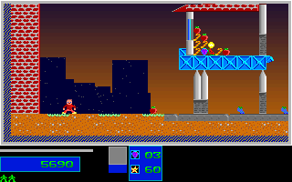

# Natural Level 1 To Level 2 Handoff

The ordinary-input Level 1 route now continues through the results
acknowledgment, next-level intro, and twelve live Level 2 frames. The repaired
port matches 305 prefix frames and twelve Level 2 frames: 20,288,000 full-frame
pixels with zero differences, plus 610 prefix and 24 Level 2 mapped states.
This extends the [completion gate](level1_completion_gate_runtime_2026-10-01.md),
[result reels](level1_results_runtime_2026-10-01.md), and
[unskipped results typing](level1_typing_runtime_2026-10-01.md).
Those results/typing boundaries remain separate registered comparisons; this
handoff report does not count their frames again.

## Recovered Rules

The new-game routine initializes both players' ammunition to `{200,20,6,0}`
at `CS:2F69` (file `0x36D9`). The common level-loading routine only resets
both selections to the first weapon at `CS:2AF2` (file `0x3262`); it does not
refill the counts. The natural route uses one large bomb and carries
`{200,20,5,0}` into Level 2. The inactive second player's counts remain
`{200,20,6,0}`. Both selections reset to Small. The previous port called a
general world reset after the intro and unintentionally refilled ammunition.
`beginLevelForPlay` now refills only on a menu new game; `finishLevelIntro`
preserves the carried counts while initializing the next world.

Level setup also reloads `BOMPAL.PAL` at `CS:2BF9` (file `0x3369`). The helper
at `CS:0709` (file `0x0E79`) reads 768 bytes and calls BIOS video service
`AX=1012`, `BX=0`, `CX=256` at file `0x0F07`. This happens after map decoding
and before the intro pattern's eight RNG draws. The red animation phase
`DS:79AD` is not reset. The native next intro retains phase 34 and restores
every BOMPAL entry except the seven newly generated intro colors, 176-182.
In particular, entry 255 changes from results grey `(31,31,31)` to
`(21,0,0)` in six-bit DAC units.

The port previously reset only three HUD colors, leaving results grey and
the preceding red-animation colors in the next level. With the inventory
fix alone, all 24 mapped states matched but 1,150 pixel colors differed
across the twelve frames, including 98 on the first frame. Reloading the
full asset palette before the intro eliminates every difference without
resetting the red phase. No RGB value was patched in the comparator.

## Native Observation

`tools/capture_original_level1_handoff.py` reuses the unchanged pinned
gameplay observer and validates its complete 305-frame canonical prefix.
It stops at the actual results `ReadKey` call, `CS:2049` (file `0x27B9`),
after the existing result reels settle. The retained baseline agrees with
the final promoted reel state, score and RNG. A fresh physical Return is
observed as BIOS queue word `1C0D` before releasing the native call.

The next stop is the actual intro `ReadKey`, `CS:2C72` (file `0x33E2`),
not an assumed elapsed timeout. A second Return lets the original continue
into normal Level 2 gameplay. The observer records pre-render, rendered,
and post-update states for native frames 306-317. It reads both complete
100x53 map planes: 5,300 tile bytes and 10,600 word-plane bytes per state.
Each boundary also retains all 256 DAC entries read through VGA ports.

The added trampolines preserve registers/flags, use previously unused DOS
resident slots, and only read palette ports. All gameplay, results and intro
hooks are restored before the successful completion footer. Original assets
remain unchanged. There is one controlled initial RNG seed and the existing
normalized gameplay input stream; there are no health, position, objective,
map, inventory, results-state or next-level seed injections.

One earlier attempt failed the stable-frame requirement and remains
incomplete. The successful producer retries only that specific unstable
presentation read, at most three times, while still requiring equal successive
frames. Its full prefix must match the old canonical fixture. Neither a
failed footer nor a differing prefix is repaired into a pass.

## Production Comparison

The extended 742-tick route retains all 22 prefix events and adds only two
Return press/release pairs for results and the next intro. The C++ replay uses
the normal SDL event adapter, level flow, update and renderer, with the original
intro wait enabled. The first Level 2 presentation is host replay tick 731,
native logic frame 306; no host wall-clock alignment is claimed.

`tools/level1_handoff.py` validates executable/instruction pins, producer pins,
source assets, prefix identity, complete native/C++ streams, fresh results
acknowledgment metadata, and hook-restoration/claim flags before comparison.
It compares full map planes, active P1 motion/fractions/animation/health,
inventory, score/reels, objectives/HUD, RNG, level, red phase, and the inactive
P2 inventory. All 320x200 RGB pixels are compared at every presentation.

The comparator additionally matches 217 stored palette entries per rendered
and post-update state. It excludes entries 176-214 from this *stored-palette*
comparison because the port resolves the original backdrop ramp through
`backdropColor`, rather than storing it in its asset palette array. Their
rendered pixels are still part of the complete RGB comparison. The report
therefore keeps `all_dac_entries_compared=false`; it does not silently claim
256-entry stored-DAC parity.

The [comparison report](evidence/level1_handoff_2026-10-01/comparison.json)
records the complete prefix and twelve subsequent frames.

Original, first Level 2 presentation:



C++, same native-render boundary:


The evidence directory also retains the last compared pair, sample 11.
These images were exported from actual native/C++ RGB bytes.

## Validation And Scope

`level_intro` exercises new games, normal next-level entry, same-level restart,
interactive skip/acknowledgment, noninteractive entry and both inventories.
It dirties all 256 colors before each reload, requires restoration of the
full asset palette, and verifies the red phase stays 34. These extra flows
are production-path model checks, not additional native captures.

`level1_handoff_original` runs a fresh production replay and full comparison.
`level1_handoff_guard` rejects 21 native evidence mutations and nine C++
projection mutations, including missing restoration, fabricated manual claims,
bad BIOS words, boolean counters, truncated large map planes, inventory
refills, stale results colors, incorrect phase/score/level and corrupted RGB.
Python site packages are disabled in both registered tests. PPM export is
mandatory; PNG export is optional when Pillow is available. Each replay
uses a unique directory and preserves earlier candidates.

The focused silent CTest batch passed all 24 selected tests in 289.86 seconds,
including the new replay/guard, existing completion/results/typing comparisons,
red palette lifecycle, level flow, render boundaries, reentry/boss evidence,
key ownership and source/evidence guardrails. The two new tests took 49.07
and 19.98 seconds respectively. Exact-head full CI and extracted-package
checks are separate delivery gates, not campaign/release acceptance.

### Startup Window Delivery Check

The first PR head, `b37d17472a21b0f31acc733d5edf25b7e217c11f`, passed all
567 Windows CTests and both extracted-package checks. Linux CI run
`36853067690` passed 570 tests, skipped its generic UI test, and failed only
`bios_menu_input_live_xvfb`. Its composition scenario received X11
`BadWindow` at `X_SetInputFocus` for window `2097154`, before sending any
keys or capturing frames. The failed log and artifact remain preserved.
The precise cause of the disappearing startup window is not established.

The BIOS input observer now searches only visible windows owned by its
existing child PID and acquires focus and geometry inside the existing
bounded startup wait. A no-match search or `BadWindow` causes rediscovery;
other tool errors and timeouts still fail. It does not relaunch the child,
extend the deadline, or change keyboard, pixel, typing-frame or game-state
assertions. Failed subprocess diagnostics retain stderr. The registered
`bios_menu_window_contract` checks ten acquisition/error cases using only
the Python standard library.

A local three-repeat batch was not fully successful: one BIOS repeat missed
the transient typing frame, the buffered-menu observer rejected its reused
output directory, and the main-menu observer missed the shift-keypad
selection. The contract and key-ownership repeats passed. These failures
remain failed and retained; host timing as an explanation is unproven.
Fresh-directory runs subsequently passed the complete BIOS, buffered-menu
and main-menu live checks with unchanged assertions and dummy audio. The
main-menu check inspected fourteen rendered checkpoints. The ten-case
window contract also passed independently and through CTest. Fresh full
CI and package validation at the updated PR head are still required.

```sh
env SDL_AUDIODRIVER=dummy TMPDIR=/dev/shm \
  python3 -S -B tools/level1_handoff.py replay --exe /path/to/lezac_cpp \
  --out /dev/shm/lezac-handoff-replay
python3 -S -B tools/level1_handoff.py guard
```

The native compact stream is pinned at SHA256
`5cb0fb3dddceb0b6d4a7e90530724205aae75e9f98ebc80500c8857885ab20b3`;
the producer at
`0af5c0a1f0ef7f87c4898ecc512784db315d281547b97bf45e57bfa5c87b1985`;
and the unchanged prefix at
`18c029dcc107cf95b088a914cf60aa05fd30fbaf26501e3b2367ee91cd96ace8`.
The original executable, base observer, typing producer and previously promoted
fixtures retain their existing pins. Unique raw captures and failed-run
diagnostics remain separately preserved.

This proves only the captured one-player Italian route and its short Level 2
entry. It does not prove all actor fields, longer Level 2 progression,
two-player/English native handoffs, typing skip/escape, uninstrumented physical
cadence, natural Level 7 boss completion or campaign/release acceptance.
`original_fidelity_claim`, `manual_input_claim`, `wall_clock_claim` and
`all_actor_fields_compared` remain false, as does whole-game functional
completion. Every launched runtime and child uses dummy audio.
