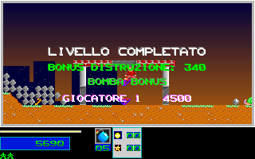

# Level 1 Results Reel Recovery

This recovers the original bonus award and score-reel loop after an
ordinary-input Level 1 completion. It does not prove continuous typing,
physical presentation cadence, key acknowledgment, Level 2 handoff, or
whole-game fidelity. Global completion and fidelity flags remain false.

## Capture Scope

`tools/capture_original_level1_results.py` runs the existing, unchanged
`tools/level1_original.py` oracle through the complete 305-frame prefix from
`tests/fixtures/level1_original/completion_gate/`. The player uses the normal
one-player start, default reserves and ammunition, and the same 22 input
events. Only the initial RNG seed and normalized control-bank input are
controlled; no health, ammunition, positions, map, counters or completion
flags are written during gameplay. Audio is dummy throughout.

After the natural empty-collapse gate, the observer restores the four
gameplay hooks and installs a register/flags-preserving hook at `1000:2000`.
It replays the original five-byte `cmp es:[di+44],2` instruction. The first
stop observes the prepared score; subsequent stops follow the preceding
advance, draw, 15ms delay and RNG draw. All hooks are restored before exit,
and shipped assets remain byte-identical. This is instrumented evidence,
not uninstrumented wall-clock or physical-key evidence.

Identity pins for the promoted compact fixture are:

- Original EXE: `7579255148c2cb540b26f70dc8181c50b218b6808d8fa5208c832391bafa53ec`.
- Unchanged gameplay observer: `f1797c57fe6363f9e189fb2ab0b9c76d32b5d2f46305458e2ba513b1d7d18758`.
- Results observer: `082e5c9f7f5c1fb34675aee8d4d7bb9a69bb78f382e79b98b860a723345fc093`.
- Native results stream: `b45a7a1561052646eaa87e169909f92ec83c5dbc0380fec9b891db9e288d59f9`.
- Gameplay prefix canonical hash: `18c029dcc107cf95b088a914cf60aa05fd30fbaf26501e3b2367ee91cd96ace8`.

The extended 660-tick C++ route retains the exact prefix input, seed and
clock step. The fixture is `tests/fixtures/level1_results/`; the earlier
six gameplay fixtures and their capture pins are unchanged.

## Native Rules

| Code anchor | Observed or statically pinned behavior |
| --- | --- |
| `1000:1DC2` | After the initial 500ms pause, set DAC index 255 to `(31,31,31)` in six-bit VGA channels. |
| `1000:1DCF` | Multiply destroyed-block count, not displayed percentage, by ten; retain the low word and zero-extend it. |
| `1000:1F5B` | Sign-extend the wrapped word sum of unused type-1/2/3 bombs weighted by 100/500/2000. |
| `1000:1FE8` | Add the whole award to the 32-bit player score before the reel loop. |
| `1000:1FF3` | Prepare score digit targets and phase 1 before the first advance. |
| `1000:2000` | Test the score-reel phase before another loop iteration. |
| `1000:201A` | Delay 15ms after advancing and drawing the reels. |
| `1000:2021` | Draw `Random(4)` after that delay; values greater than two request the tick sound. |

This route destroys 34 blocks, although its displayed percentage is 51.
The native destruction bonus is 340, unused-bomb bonus 4500, and whole award
4840. Logical score changes immediately from 850 to 5690. All nine reels
retain their current positions, with even digits advancing by 16 and odd
digits by 8 modulo 640. There are 41 advances and 41 RNG draws, including
the final no-change iteration that marks phase 2. Final RNG is 2602717913.
Players, inventory, actors, maps, collapse/debris and gameplay frame remain
frozen. A 200ms pause follows the loop before key wait.

The C++ port previously used `51 * 10`, awarded chunks of 100, and left HUD
score animation frozen. Results now advance only their score reels. They
retain the actual last-presented pre-actor frame rather than redraw the
post-actor world. Indexed pixels also retain their VGA palette provenance:
later palette writes can recolor frozen pixels without advancing gameplay.
Fixed RGB paint remains unchanged; duplicate palette colors are not reverse
mapped to guessed indices. The retained planes participate in snapshot,
restore and level reset.

## Comparison Evidence

The production replay matches 305 full gameplay frames, 610 mapped prefix
states, and all 42 native result-loop frames and mapped result states:
22,208,000 pixels compared, zero differing pixels. No crop or palette
normalization is used. The result boundaries are phase-aligned, not timed
to equal host wall-clock instants. Not every retained actor byte is projected;
raw native gameplay tables are checked for unchanged state during results.

The final [comparison report](evidence/level1_results_2026-10-01/comparison.json)
pins the C++ executable, trace and result stream. An intermediate retained
RGB-only frame had correct score/reels/RNG but 43,764 differing pixels,
1,042 in each result frame. Its [failed comparison](evidence/level1_results_2026-10-01/palette_before_comparison.json)
is preserved separately. Indexed retention and the native DAC write resolve
that discrepancy; failed captures were not relabeled as passes.

Original after the final delayed RNG draw, sample 41:



C++ at the corresponding boundary:


The same directory retains original/C++ pairs at samples 0, 1 and 20.
Unique raw captures and intermediate diagnostics remain in RAM.

## Validation And Reproduction

All 42 selected silent local CTests passed in 301.05 seconds, covering the
six original gameplay routes, native results, indexed render boundaries,
HUD, palette, UI, startup RNG, replay integrity and evidence/status guards.
This is local validation, not full CI or release acceptance.

`level_results` checks award/reel/RNG order, delayed draws, duplicate updates,
host batching, clock rollover, zero bonus, inactive players and native word
wrap. Two-player ordering and overflow cases are model tests, not new native
two-player runtime captures. `level1_results_guard` rejects eight semantic
mutations, including missing RNG, percent-based scoring, early settlement,
gameplay advance and damaged RGB. It also verifies source and fixture hashes.

```sh
env SDL_VIDEODRIVER=dummy SDL_AUDIODRIVER=dummy TMPDIR=/dev/shm \
  python3 -B tools/level1_results.py replay --exe /path/to/lezac_cpp \
  --out /dev/shm/lezac-results-replay
python3 -B tools/level1_results.py guard
```

Replays create a unique child directory and preserve prior outputs. Native
recapture requires a private Xvfb display and explicit process-memory and
runtime-instrumentation approvals. Continuous native typing/skip behavior,
physical 15ms presentation, acknowledgment and the first live Level 2 frame
remain the next integration frontier. This result is not complete campaign,
natural Level 7 boss-run, whole-game or release acceptance.
