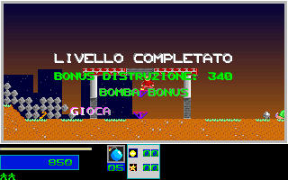

# Natural Level 1 Results Typing

This extends the ordinary-input [completion gate](level1_completion_gate_runtime_2026-10-01.md)
and [results-reel recovery](level1_results_runtime_2026-10-01.md). The unskipped
Italian, one-player results sequence now matches all 89 native typing boundaries,
the 305-frame gameplay prefix and the 42 result-reel boundaries: 27,904,000
full-frame pixels with zero differences. This is instrumented boundary evidence,
not uninstrumented wall-clock playback, a physical keyboard run or whole-game
fidelity. Completion and fidelity flags remain false.

## Native Recovery

The typing helper starts at `CS:146A` (file `0x1BDA`). It centers the unpadded
caption, inserts five spaces at both ends, and slides a five-column window.
Each window writes foreground colors from high to low, then requests an 81ms
delay. Only its newest column draws a shadow; a zero shadow argument skips
the shadow write, rather than erasing an existing shadow. Replaying those
writes in native order preserves overlapping glyph pixels and earlier shadows.

The observer freezes at `CS:1611` (file `0x1D81`), immediately before the push
and relocated far delay call. Its trampoline preserves registers and flags,
then replays both instructions together so the delay argument stays in the
correct stack position. All gameplay and typing hooks are restored before exit;
the shipped assets remain unchanged. Neither gameplay nor RNG is reseeded at
results entry. The prefix retains the existing controlled initial RNG and
22 control-bank input events, default player reserves and ammunition. There
is no teleport, health, weapon, map-damage or completion-state injection.

| Line | Native Loop Bound | Cell | High/Low Colors | Shadow |
| --- | ---: | ---: | --- | ---: |
| `livello completato` | 23 | 11 | 31/27 | 25 |
| `bonus distruzione; 340` | 27 | 9 | 244/240 | 241 |
| `bomba bonus` | 16 | 9 | 244/240 | 25 |
| `giocatore 1   4500` | 23 | 9 | 31/27 | 13 |

The native `font_base` values are one-based: 1 for the large face and 27
for the small face. The original semicolon character in the destruction
caption selects the glyph rendered as a colon by the port.

The initial padded window is empty, followed by the caption and its trailing
fade. A line therefore takes `(unpadded_length + 5) * 81` nominal milliseconds,
not `unpadded_length * 81`. The previous 69-step schedule omitted 20 delays,
or 1,620 nominal milliseconds. The last native typing boundary is at 7,628ms
after results entry; its final 81ms delay ends at 7,709ms. Only then is the
whole 4,840-point bonus awarded, taking the score from 850 to 5,690. The existing
41 reel advances and delayed RNG draws follow unchanged.

## Production Comparison

`LevelFlow` tracks the native window boundaries and preserves their order under
batched updates and unsigned clock rollover. The regular results renderer
reconstructs each line's actual glyph/shadow writes over the retained gameplay
frame. The intro renderer and intro schedule are unchanged.

`--replay-level1 ROUTE OUTPUT_DIR --original-intro-wait --result-reels --result-typing`
adds diagnostic images at the scheduled draw-before-delay boundaries. The
observer uses the normal update model and renderer, sampling only the outro
rendering clock at each boundary. It does not advance gameplay, award score,
draw RNG, or seed gameplay state. Every mapped native/C++ typing state is
compared, in addition to each full 320x200 RGB image. Score, reels, player/map/
actor state and RNG stay frozen throughout the 89 samples.
The comparator validates complete C++ snapshots and requires every observed
field except the independently pumped sound latch to stay unchanged. This
also checks actors and controller state hidden behind the retained image.

The [comparison report](evidence/level1_typing_2026-10-01/comparison.json)
includes the 610 mapped gameplay-prefix states, all 89 typing frames/states,
and the unchanged 42 reel frames/states. It records zero differing pixels
across 27,904,000 pixels. The C++ logical schedule is verified against the
native delay arguments and loop bounds; actual wall-clock cadence is not claimed.

Original while the player line is still typing, sample 71:



C++ at the matching draw-before-delay boundary:


The evidence directory also retains pairs at samples 5, 28 and 88. All pairs
were exported from actual native/C++ frame bytes, not fabricated images.

## Provenance

- Original executable SHA256: `7579255148c2cb540b26f70dc8181c50b218b6808d8fa5208c832391bafa53ec`.
- Native typing producer: `tools/capture_original_level1_typing.py`, SHA256
  `53285006b7ce80b60f5a929f931478b6514fbb40815e3cc9b1d19007f9e0d76e`.
- Native compact typing stream: `tests/fixtures/level1_typing/reference.jsonl.gz`,
  SHA256 `824fcf62bc31c42d6b128bb42eec3d0f82e6f2e60ed22c366eb345a76150cfbf`.
- Prefix canonical SHA256: `18c029dcc107cf95b088a914cf60aa05fd30fbaf26501e3b2367ee91cd96ace8`.
- The base gameplay observer and previously promoted gameplay/results fixture
  pins are unchanged. Unique raw captures and incomplete earlier typing
  attempts remain preserved separately; no incomplete footer was repaired or
  failed candidate relabeled as a pass.

## Validation And Limits

`level_results` asserts the 89 scheduled steps, the initial empty window,
duplicate-update suppression, the last trailing delay, award/reel/RNG order,
host batching and clock rollover. Existing two-player/overflow cases remain
model tests, not new original runtime captures. `level1_typing_guard` rejects
13 damaged variants, including missing padding/delays, changed color/shadow,
early scoring or RNG, gameplay movement and corrupted RGB. Source, executable,
fixture and prefix checks are mandatory. Boolean substitutions for numeric
window indices are rejected, even when Python would consider them equal.

Comparison always exports portable PPM images. PNG is optional when Pillow is
available. The registered replay and guard disable Python site packages, so
the comparison needs no third-party Python modules. Replays use unique output
directories and preserve previous candidates.

```sh
env SDL_VIDEODRIVER=dummy SDL_AUDIODRIVER=dummy TMPDIR=/dev/shm \
  python3 -S -B tools/level1_typing.py replay --exe /path/to/lezac_cpp \
  --out /dev/shm/lezac-typing-replay
python3 -S -B tools/level1_typing.py guard
```

An initial focused CTest run used the old exact stdout expectation for
`level_results`. Its implementation assertions passed, but the test was
correctly reported failed because the newly added typing fields were absent
from the expected line. The failed log is retained; the exact expectation
was updated to require those fields, without removing the existing assertions.

After regeneration, the expanded focused batch passed all 48 selected tests
in 726.60 seconds, including original gameplay routes, result reels, render
boundaries, palette lifecycle and source/evidence guardrails. The strengthened
comparator separately rejected three damaged C++ streams: a boolean step,
a missing actor field, and a hidden actor-order change with identical pixels.
Its no-site full comparison again matched all 27,904,000 pixels. These are
local focused checks; exact-head full CI and packaging are separate gates.
After tightening the C++ snapshot validator and native mutation cases, all
eight final contract tests passed in 69.32 seconds, including a fresh
production typing replay and the 13-case guard.

Typing key-skip/escape behavior, the ordinary results acknowledgment, the
first live Level 2 frame, new native two-player/English results captures,
physical display cadence, natural Level 7 boss completion and whole-campaign
release acceptance remain open. No waveform or audible-output parity is
claimed. All agent-launched runtime work uses dummy audio and a private display.
