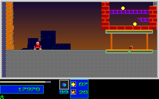

# Level Setup Energy And Objective Carryover

This repairs the ordinary Level 2 to Level 3 handoff. It does not establish
whole-game fidelity, natural Level 7 boss completion, physical-input timing,
all actor bytes, every stored DAC entry, or release acceptance. All original,
C++ and child processes use dummy audio.

## Native Rule

The pinned original `LEZAC.EXE` SHA256 is
`7579255148c2cb540b26f70dc8181c50b218b6808d8fa5208c832391bafa53ec`.
Its file image base is `0x770`. Read-only instruction inspection establishes:

| CS Offset | File Offset | Rule |
| --- | --- | --- |
| `2AFF` | `326F` | Previous destruction HUD value becomes 200. |
| `2B04` | `3274` | Previous collected HUD value becomes 20000. |
| `2B31`, `2B36` | `32A1`, `32A6` | Objective-completion flags become zero. |
| `2BBE` | `332E` | Destroyed-structure count becomes zero. |
| `2BC8` | `3338` | Collected-objective count becomes zero. |
| `2BCD` | `333D` | Sampled destruction percentage becomes zero. |
| `2BD2` | `3342` | Fade queue count becomes zero; its old entry bytes survive. |
| `2C72` | `33E2` | The next intro waits at the original `ReadKey` call. |
| `2CEA` | `345A` | Energy repaint cache becomes 255 after intro acknowledgment. |
| `2F30`, `2F35` | `36A0`, `36A5` | Only the new-game path initializes both energy bytes to 100. |

The post-intro player-record initialization does not write the separate
energy bytes `DS:1BAC` and `DS:1BD2`. The observed Level 2 exit, next intro,
and twelve Level 3 entry frames retain P1 energy 90. HUD reserve digits are
not treated as health evidence.

`beginLevelForPlay` now initializes energy only for a menu new game, and
resets the objective counters/HUD before the intro. The narrow
`resetHudObjectivesForLevel` helper preserves energy caches, inventory,
reels, palette colors, fade-entry bytes and the frozen results bitmap.
`finishLevelIntro` preserves both players' energy through world setup.
The existing post-acknowledgment full HUD reset remains in place. Direct
world-reset fixture behavior, inventory carryover, palette reload, intro RNG
and late boss initialization order are unchanged.

## Continuous Route Evidence

The retained native V20 observation starts with the pinned natural Level 1
prefix, continues into Level 2, reaches its actual objective/destruction
completion gate, observes all result reels, acknowledges those results with
a fresh Return, and acknowledges the Level 3 intro with a second fresh Return.
It then records twelve ordinary Level 3 frames, native frames 2670-2681.
There are no added position, map, objective, inventory, energy, result-state
or level-selection injections. Existing normalized input and the controlled
initial RNG seed remain part of the observer protocol, not manual play.

The completed V20 C++ replay failed: the next intro retained collected 3,
destroyed 243 and stale HUD values; Level 3 energy became 100 instead of 90.
Eleven of the twelve Level 3 presentations differed by ten energy-bar pixels
each. That failed stream, its 110-pixel mismatch and the diagnostic remain
retained; the new result does not replace their failed status.

The corrected V21 executable replays the same full 3,788-tick route with
116 input events, 14,046 checkpoints and 3,789 raw presentation frames.
Its complete stream has a validated footer and unchanged asset/route hashes.
The comparison covers these retained original boundaries:

| Region | Presentations | Mapped Boundaries | Differing Pixels |
| --- | ---: | ---: | ---: |
| Level 1 gameplay | 305 | 610 | 0 |
| Level 1 results | 42 | 42 | 0 |
| Level 1 results acknowledgment | 1 | 2 | 0 |
| Level 2 intro | 1 | 2 | 0 |
| Level 2 initial entry | 12 | 24 | 0 |
| Level 2 extended gameplay through its gate | 2352 | 4704 | 0 |
| Level 2 results | 34 | 34 | 0 |
| Level 2 results acknowledgment | 1 | 2 | 0 |
| Level 3 intro | 1 | 2 | 0 |
| Level 3 initial entry | 12 | 24 | 0 |
| Total | 2761 | 5446 | 0 |

All 176,704,000 displayed RGB pixels in those presentations match. This does
not count all 3,789 replay frames as independently matched native frames.
The mapped state covers full map planes, active P1 motion/fractions,
animation, energy, inventory, score/reels, objectives/HUD, RNG, red phase,
level and inactive P2 inventory. Stored palette comparison covers the existing
217 entries, excluding 176-214; their displayed pixels are still compared.
All actor fields and all stored DAC entries remain explicitly unclaimed.

The audit additionally compares all 13,597 retained V19 prefix records. Only
the six objective cells during 210 Level 2 intro records are replaced with
values independently derived from native bytes: `progress[0:2]` and HUD
indices 0, 1, 2 and 5. Every other prefix field must remain exact. Eight policy
guards check isolation and sensitivity to unrelated changes. All 3,643 old
prefix PPM files and the complete 76-sample result stream/images remain byte
identical. There is no blanket intro exclusion or comparator pixel patch.

## Identity And Retention

The [comparison report](evidence/level_setup_2026-10-02/comparison.json),
[instruction pins](evidence/level_setup_2026-10-02/instruction-pins.json),
compressed comparator snapshot and compact native Level 3 stream are retained
with a file-hash manifest. Important SHA256 identities are:

- C++ executable: `1e2875688fe9f606f34932819d8de89d27f837abf7793aa8462976f0533b54a7`.
- Full C++ trace: `322f1849139ce0c3e6d2469d34b7d3af383524203441c2345fdd6306ad104b55`.
- Native Level 3 handoff: `f47daa4962c1294c315ccfa66a8d99e074721068abb159a610862d4d4889e69e`.
- Native Level 2 gameplay: `64829a917bcbd36b297c0da158d9984852c220550e617fc27a61fa4e5f0462e9`.

The full 64-file native capture already has a byte-verified backing-disk copy
in the retained failed-V20 evidence bundle. V21 compact provenance references
that immutable capture rather than duplicating it. Full comparison reexecution
requires those retained private bundles and the archived C++ prefix; the
public summary alone is not a self-contained registered replay fixture.
Full C++ replay retention and RAM-only archive limitations are recorded in the
archival proof, separately from the scoped comparison result.

The [full archival proof](evidence/level_setup_2026-10-02/archive-verification.json)
verifies all 1,216,496,500 raw bytes against the retained 55,049,896-byte archive,
SHA256 `6ca91568f83bfe3a3ae8f40d5d359051b851099c7cb3d50d6a0914a6d8706423`.
Only the redundant raw directory was removed after complete footer/inventory,
byte/hash, literal-path, no-symlink and twice-inactive/unchanged checks. The
archive remains RAM-only at
`/dev/shm/lezac-level-setup-handoff-cpp-20261001-v21.tar.gz`; do not restart WSL
or claim that the full replay has been copied to backing disk. Compact V21
provenance and the complete native oracle have backing-disk copies. RAM free
space rose from 1,403,793,408 to 2,566,746,112 bytes; this is not Windows disk
recovery. No reserve threshold was reduced.

Original, twelfth Level 3 presentation:

C++, same native-render boundary:

## Regression Coverage

The strengthened `level_intro` probe covers new-game refill, both players'
carried energy, successive transitions, F5 same-level restart, noninteractive
entry, reset objectives during the blocking intro, and energy-cache invalidation
after acknowledgment. Existing hashes, timing, inventory, palette and input
contracts remain asserted. The render-state boundary test checks that the
objective-only reset preserves all other HUD fields, colors and frozen results.

The fresh Release build passed all fourteen focused CTests in 40.69 seconds,
including results/menu models, HUD models/live HUD, intro, render-state
boundaries, death/reentry, transition and original-backed boss reentry guards.
Exact-head full Linux/Windows CI and extracted-package checks are separate
delivery gates required before merging this batch. Neither those checks nor
this Level 3 entry comparison proves full campaign or release acceptance.
