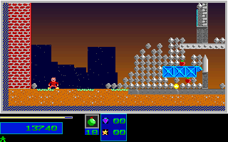

# Natural Campaign Regression Through Level 3 Entry

The retained V20 original capture previously supported the focused
[level-setup carryover recovery](level_setup_carryover_runtime_2026-10-02.md).
Its successful ordinary Level 2 completion was not a self-contained registered
route regression. This batch promotes that evidence and replays it on the
current C++ build. It changes no production gameplay rules.

This is distinct from the recent [500-frame Level 2 table route](natural_level2_runtime_2026-10-05.md),
which collected zero objectives. Those two shorter routes do not imply that
no previously observed route completed Level 2. The full-game objective remains
open even with this bounded one-player Level 1/2 completion route.

## Coverage

| Region | RGB Presentations | Mapped Boundaries |
| --- | ---: | ---: |
| Level 1 gameplay | 305 | 610 |
| Level 1 results | 42 | 42 |
| Level 1 results acknowledgment | 1 | 2 |
| Level 2 intro | 1 | 2 |
| Level 2 initial entry | 12 | 24 |
| Level 2 extended gameplay through completion | 2,352 | 4,704 |
| Level 2 results | 34 | 34 |
| Level 2 results acknowledgment | 1 | 2 |
| Level 3 intro | 1 | 2 |
| Level 3 initial entry | 12 | 24 |
| Total | 2,761 | 5,446 |

The original reaches its first eligible empty-collapse gate at native frame
2669, route tick 3094. It has three collected objectives, 243 destroyed
structures, 61-percent destruction, P1 health 90 and one remaining reserve.
The unchanged route naturally loses a reserve; default lives are not increased.
Results settle at score 17,970, and the next level carries health and ammunition
while resetting objective counters. Separate BIOS Return events acknowledge
results and the Level 3 intro. Twelve Level 3 entry frames are observed.

The compact reference pins 176,704,000 RGB pixels by complete-frame SHA256 and
both complete map planes at each mapped boundary. The existing projection
includes P1 position, velocity/fractions, animation, energy, reserves, inventory,
score/reels, HUD, objectives, RNG, level, red phase and inactive P2 inventory.
Palette comparison retains the existing 217-entry scope. Other actors and all
stored DAC bytes are not independently compared by this regression.

## Provenance And Guards

The packer accepts no C++ expected-value input. It verifies hard-pinned native
manifests and observer sources before creating an output, then checks every
native file hash and shipped asset, the canonical Level 1 prefix, the exact
3,788-tick route, all phase sequences, complete native map extents, completion
flags and collapse count, result-world freezing, one RNG draw per result step,
award/phase values and fresh separate BIOS acknowledgments.

The new fixture is 400,450 bytes before its README: 364,617 compressed reference
bytes, 2,033 route bytes and 33,800 typed projection-guard bytes. It does not
depend on ignored private capture directories during comparison or CTest.
Source snapshots and pinned capture manifests are retained alongside the report.

Guard coverage rejects ten fixture/semantic mutations, seven producer changes
before output creation and 291 typed C++ field/map/palette mutations. Every
guard changes its input, a valid typed baseline must match, and a negative
control retains the explicit exclusion of DAC entries 176..214. No failed
comparison field is omitted or comparator policy weakened.

The two retained original captures independently agree across all 2,352
Level 2 framebuffer hashes and 7,056 pre/rendered/post mapped boundaries.
Their raw stream hashes differ; whole raw clock/sound/actor-byte equivalence
is not claimed. These are historical captures, not fresh original execution.

## Current Replay

The current Linux release executable SHA256 is
`d8c9f1baea3eed69091091d2874d87513f8f997754b7cada58cd678c8f87d8d1`.
Its fresh complete replay trace SHA256 is
`322f1849139ce0c3e6d2469d34b7d3af383524203441c2345fdd6306ad104b55`,
identical to the retained corrected V21 trace. That identity alone is not
substituted for the new direct native-derived comparison.

The full replay has 3,789 presentation files, 14,046 checkpoints, 116 input
events and a validated 3,788-tick footer. Only the 2,761 native-observed images
above are counted as independently original-backed, not all replay images.
CTest uses silent normal SDL input/production updates and retains each run
under a fresh UUID. Platform CI and package checks remain separate delivery
gates; their exact-head results are recorded in the pull request.

The first compact fixture selected the Level 1 results PPM for the later
Level 2 acknowledgment. Direct comparison rejected that boundary. The corrected
packer selects the pinned native Level 2 acknowledgment framebuffer hash;
the failed fixture/comparator and complete replay remain retained separately.
The port was not changed to accommodate the failed fixture.

Original at the Level 2 gate:

Current C++ at the same displayed boundary:

## Remaining Work

This closes the regression gap for this specific ordinary Level 1/2 route,
not every Level 2 route, all actors, two-player/English campaigns, later level
completion, natural Level 7 boss victory, physical timing or release acceptance.
The four broad OPEN items, whole-game fidelity and functional-completion flags
remain unchanged. An overall completion percentage is still not defensible.
