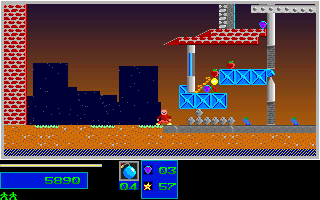

# Natural Level 2 Tables And Route

## Result

Two new ordinary-input routes after the pinned Level 1 completion and natural
Level 2 handoff each match 500 original 320x200 frames, 1,000 mapped
present/post boundaries and 32,000,000 RGB pixels without differences.
The jump-obstruction route also matches 6,050 live debris-record observations,
4,151 collapse-record observations and 1,339 naturally spawned monster states.
These are repeated observations, not counts of unique objects.

No gameplay code changes were needed for these routes. The compact permanent
fixture and `natural_level2_original` regression exercise the normal SDL
event adapter and production loop from the existing single initial seed.
There is no per-tick actor, player, world, health or RNG reseeding, no relocated
spawner and no substituted terrain. Native control-bank events remain
normalized inputs, not physical keyboard/typematic or wall-clock evidence.

## Route And Outcome

The retained complete route includes the pinned Level 1 completion, unskipped
results/typing and acknowledgments. Its extension starts at C++ tick 743 /
native frame 318. The player moves right, switches to Large using two
left+right chords, drops one bomb at extension sample 86, retreats left,
then returns and jumps at sample 328. The original and C++ player both
finish at `(169,368)` with health 100, two reserve lives and four Large bombs.
Both have collected zero objectives and destroyed 12 counted structures.
All four objective tiles survive; two have fallen to `(272,280)` and
`(216,344)`. Fallen beams block the attempted jump in both versions.

The other matched route bombs the right-hand pillar and returns along the
ground. It collects no objective and destroys 14 counted structures.
The left blast without the return jump was also explored in C++ only;
it is not original parity evidence. A static export initially used zero-based
index 2 and therefore depicted Level 3; the corrected Level 2 export uses
index 1. Both exports and all exploratory outputs are retained with their
actual scope rather than counted as original captures.

## Native Capture

The source observer is the unchanged, hash-pinned
`evidence/pickup_landing_2026-10-01/base-observer.py`, imported by the retained
`evidence/natural_level2_20261005/route-explorer.py` snapshot. The wrapper
explicitly overrides its historical root, frame count and event dictionary.
It reads one complete 65,536-byte data segment at the initial post boundary,
then pre/rendered/post for each of the 500 extension frames: 1,501 snapshots.
The main routine is stopped while interrupts continue, so clock/sound bytes
are not claimed byte-equivalent. Hooks are restored before owned DOSBox
termination; the original and all shipped assets retain their pinned hashes.

`tools/natural_level2.py pack` checks the canonical Level 1 prefix, complete
handoff, matching route/assets, extension and DS stream hashes, live table
bounds, frame/sequence alignment and agreement between the retained actor,
visual, player, inventory, score, destruction, progress and spawner bytes
and each full DS snapshot. It validates all 1,500 extension snapshots before
extracting the 1,000 present/post boundaries. C++ state is not used to derive
expected values; its manifest supplies only independently checked route and
asset provenance.

Original live debris uses the existing `original_debris_table.py` decoder:
DS `207E` is the last live slot, with slots 200..1600 and 11-byte records at
`2093 + slot*11`. Collapse count is DS `2080`, with 15-byte records at `6620`.
All raw fields are compared in original byte order against their typed C++
counterparts. Derived C++ collapse display coordinates/count are excluded.
Normal active monsters use the live actor and visual bounds; the projection
compares identity/spawner link, signed position/hotspot, velocity/fraction
words, three AI words, animation cursor/range/counter/delay/mode/step and
native zero-based HP plus one. This route contains kinds 1/2, behaviors 3/4;
other actor kinds, corpse paths, edge-cache words and descriptors are excluded.

The existing handoff projection compares mapped player state, inventory,
score/HUD, RNG and palette entries outside indices 176..214. Both complete
map planes and every displayed RGB pixel are hash-pinned independently.
This is not an all-DAC-entry comparison or an all-actor-byte comparison.

## Verification And Limits

The compact reference is 95,373 bytes, SHA-256
`c8bc377adb3dc8942273566874b9b6cbacd5b75b7c076c142dacdee54c0b8bf3`.
The fixture route is SHA-256
`53b82b21f7357d0eb5a46d457e1de30687b7572e12328659e2295a3404220d1e`.
The guard rejects 42 field mutations, three malformed fixture payloads and
two invalid live bounds, and verifies signed decoding and stale-tail exclusion.
Local comparison against the previously tested Linux release binary matches
the compact fixture, including a fresh replay and both new local CTest checks.
A second independent original capture agrees on every projected boundary and
RGB hash. Its native extension and full-DS gzip hashes differ, as expected for
capture-local registers/interrupt state; those two header hashes are verified
independently and excluded only from the cross-capture projection comparison.
The shared projected body SHA-256 is
`4a84d976b440c1dfc34863b9bceba1f7711edea84740f080f4cfa1226239e580`.
Exact-head CI is required before merge.

The prior main revision `ea4db963818ca808c6dbc851c2b833348f97cd11` has now
passed its post-merge CI: 631/631 Windows tests and 635 passed / 636 registered
Linux tests, with the expected `ui_xdotool_xvfb` skip. That run is historical
validation of the prior revision, not validation of this new fixture/test batch.

Level 2 completion still requires three objectives and 60-percent destruction;
these routes do neither. Later natural campaign levels, complete boss victory,
broader actor-pool interactions and physical/audio timing remain open.
All four broad OPEN items and whole-game completion/fidelity flags stay
unchanged. Passing regression percentages are not an overall recovery metric.

## Screenshots

The end-of-route frames below are aligned and pixel-identical. They show the
same failed jump route, not completion or a gameplay fix.

Original:

C++:

