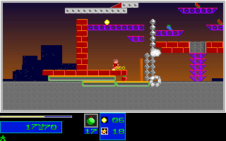
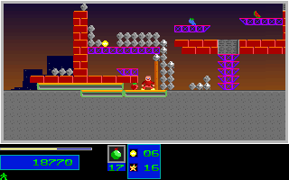

# Natural Level 3 Bomb And Objective Regression

## Scope

This promotes the fresh original-verified Level 3 movement, weapon-chord,
Medium-bomb and first-objective sequence to a self-contained production replay.
It does not change gameplay rules or seed the Level 3 world, health, inventory,
RNG or level. The only initial seed remains the existing canonical Level 1
prefix seed. Gameplay controls are ordinary normalized control-bank events;
results and intro acknowledgments are separately verified fresh BIOS Return
inputs. Physical keyboard and wall-clock timing are not claimed.

The unchanged ordinary Level 1/2 completion and Level 3 entry prefix has 3788
ticks. The new segment adds 650 gameplay frames, for a complete 4438-tick route.
The new CTest compares the whole prefix and extension: **3411 complete RGB
frames, 6746 mapped boundaries and 218304000 pixels**. Of these, **650 frames
and 1300 mapped boundaries** are the added Level 3 segment. The Level 1 result
reel reference is the registered historical native fixture, not a newly
sampled reel stream.

The first pickup is native Level 3 sample 211 / C++ tick 3988. Both endpoints
have one collected objective, 36 destroyed structures, 62 health, one reserve,
score 18770 and inventory `[200,17,0,0,1]`. The remaining objective tiles are
preserved in the full 150x60 native map planes.

## Independent Native Evidence

The original observer recorded 662 Level 3 frames: the existing 12-frame entry
plus the new 650. The pinned stream SHA256 is
`423787e0742896b696f4890ca7f4566291eee9c4e5f7bcf169d18780a35c09c8`.
All observer hooks were restored. No native validation failure is relabeled
as a passing capture.

The packer checks ten pinned producer/controller/journal files before creating
output, every captured-file hash, original assets and executable, the canonical
Level 1 prefix, all mapped/RGB Level 2 and entry observations, frozen Level 2
results, BIOS queue acknowledgments, complete native frame/phase sequences,
9000-byte tile and 18000-byte word planes, all three observed palettes, decoded
RGB deltas and the complete input-bank journal. Writes must match only the
declared gameplay controls at the documented pre-update boundary.

The fixture contains no C++-derived expected values. Its typed guard input is
reconstructed from native endpoint data and is never used as game state.
The older fixture and new extension share comparison and projection-sensitivity
helpers without changing their existing on-disk contracts or comparison scope.

The full raw capture, native screenshots, source/controller copies, journal,
logs and audit are retained as **735 members / 29589100 bytes**, with independently
fetched archive SHA256:
`270187c8d1b80f8b9a3cae952226e891da5679d5fcfd8ceae8db110e22aa4925`.
The remote ref is `refs/notes/qa-natural-campaign-20261005-level3-native`, anchored
on `3f12dbe6625e84a675016ad609ab60aa1ac7c6f1`. Whole-archive byte readback and every
member's size/SHA256 passed. No raw source was deleted. Full older C++ replay
bytes are reconstructible from the preceding `cpp` and `packages-candidate`
notes and their byte-verified alias inventories.

## Regression And Guards

- `natural_level3_objective_original`: the full production route, including
  both completed levels, their results, the entry and the new segment.
- `natural_level3_objective_guard`: 18 semantic/fixture mutations, ten producer
  mutations rejected before output creation and 291 typed/map/palette changes.
- Positive native-only projection reconstruction and the excluded DAC negative
  control are required; palette entries 176..214 remain outside mapped scope.
- The existing `natural_campaign_original` and `natural_campaign_guard` remain
  separate regressions with their original 2761-frame/5446-boundary contract.

The mapped scope covers P1 position, velocity/fractions, animation, energy,
reserve, inventory and reels; P2 inventory; level, progress, HUD, score, RNG,
red phase; full tile/word hashes; and 217 stored palette entries. Every compared
presentation uses the entire 320x200 RGB frame. All raw actor and spawner bytes
are retained but this fixture does not compare every actor field.

## Local Validation

Focused Linux CTest passed 4/4 in 250.95 seconds, including both the existing
campaign and new Level 3 replay/guard pairs. Native Windows passed both guard
commands and the full 3411-frame/6746-boundary comparison. These local runs used
the unchanged production executables from tested PR head `3f12dbe6`: Linux
SHA256 `d8c9f1baea3eed69091091d2874d87513f8f997754b7cada58cd678c8f87d8d1`
and Windows SHA256
`8d4bd1c24407e819947ea33241c37d69c8395ed34c1338581df47d51607e6051`.
They are not a claim that the new commit's release artifacts were tested.
Runtime/visual claim guardrails and the port-completion checker also passed.
Exact-head CI and release validation are recorded separately in the PR.

## Screenshots

Pickup checkpoint, native sample 212 / C++ tick 3989:

Endpoint, native sample 661 / C++ tick 4438:

## Limits

This remains a bounded ordinary route, not Level 3 completion, full campaigns,
all actor fields, manual input or audio timing, natural Level 7 victory or
whole-game parity. No global completion/fidelity flag or broad OPEN item changes,
and the number of passing tests is not an overall recovery percentage.
