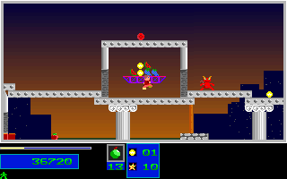
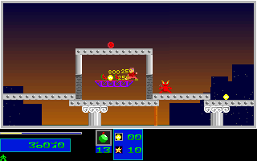
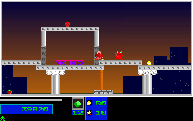

# Natural Level 3 Portal Escape

## Scope

The separate 6609-tick ordinary-input route completes Levels 1 and 2, returns
through the Level 3 portal at tick 6109, then escapes the known idle death.
It collects objectives seven and eight at ticks 6341 and 6433. This is not
Level 3 completion: the endpoint has 80 of the required 148 destroyed tiles.
The existing 6228-tick portal fixture remains byte-for-byte unchanged.

The new fixture contains 500 native-observed frames and 1000 mapped boundaries
from ticks 6110 through 6609. Its full production replay compares 5582 RGB
frames, 11088 mapped present/post/result boundaries and 357248000 pixels,
including the unchanged earlier campaign fixtures through tick 6109. Expected
data is packed only from the original `LEZAC.EXE` capture, never C++ output.

Only normal X/Z/M/N/C events extend the immutable prefix. No health, lives,
position, inventory or progression was injected. All launches use dummy audio.

## Native Checkpoints

| Tick | Objectives | Destroyed Tiles | Energy | Reserve | Medium Bombs | Position |
| --- | --- | --- | --- | --- | --- | --- |
| 6354 | 7 | 80 | 26 | 1 | 13 | 605,120 |
| 6609 | 8 | 80 | 9 | 1 | 12 | 632,136 |

The native pre/rendered/post player state stays active, mode zero, throughout
the new 500-frame branch. This differs from the unchanged old portal fixture:
its tick-6228 endpoint is state two with raw energy 100 and pending reserve
loss, not a healthy active player. Tick 6354 is a healthier ordinary-input
fork for pursuing the remaining 68 destroyed tiles.

## Provenance

The raw native stream SHA-256 is
`9a2276ce16289f30fd2405df79d351bbf32437a00167d03a472dd83af521cb59`.
The route SHA-256 is
`026c1bd917d77993bcf710a78a238136594a0968b84285e1ea8fa2b9e34d4eaf`.
The packed reference SHA-256 is
`33a6f04d1acd0f0136d2b6b02038f9f55632d0b2f10bd817344c726a1bf3c449`.
The endpoint typed guard input SHA-256 is
`18dbb8a1f303ca3f2f4dc60e1101f1723ba2cea7b52986cc5756581ff228ff5e`.

The twelve compressed producer/configuration/journal/manifests are pinned in
`tools/natural_level3_portal_escape.py` and retained under
`evidence/natural_level3_portal_escape_20261005/`. The capture audit records
2333 unchanged native Level 3 prefix frames and 6999 pre/rendered/post
boundaries through tick 6109. Packing checks the complete frame and input-bank
journal, decodes every RGB delta, verifies all captured-file and shipped-asset
hashes, and rechecks fresh present/post/RGB prefix data against the existing
canonical campaign fixtures. All runtime instrumentation patches were restored.

Full raw capture files are reconstructible from
`refs/notes/qa-natural-level3-20261005-lower-objectives-d2be-delivery-raw`
and its five `-part-NNN` refs. The archive SHA-256 is
`1846c8195b5f841618f9d7f0310a9c714f4f2d1d0bbf1a83ae7bb88297d8bcfd`.
The archive's `final-delivery-source-inventory.json`, logical label
`portal-escape-native`, maps each original path to its stored member and byte
hash, including aliases. All 7738 archived members were independently fetched
and verified before the previous keeper closed, then verified again during
restoration for this fixture. `native-provenance.json` retains the exact refs,
chunk hashes, capture pins and verification scope.

## Validation

The unchanged `natural_campaign.compare_rows` comparator checks the complete
normal SDL production replay, not only the added branch. The guard rejects
38 semantic/fixture mutations, twelve altered producer files and 291 typed
state/map/palette mutations. Producer mutations must fail before creating any
output. Truncated, appended and corrupt references, altered route/guard bytes,
false completion/death-state claims, moved pickups, reserve loss and changed
healthy-fork/endpoint contracts are rejected.

Registered commands:

```sh
env SDL_AUDIODRIVER=dummy ctest --test-dir build --output-on-failure \
  -R '^natural_level3_portal_escape_(original|guard)$'
```

Native-only reconstruction of the fixture, with a fresh output directory:

```sh
python3 -S -B tools/natural_level3_portal_escape.py pack \
  --capture /path/to/restored/native --out /path/to/fresh/fixture
```

The paired captures below are actual original/C++ frames from the separately
captured scout and have zero pixel differences. They are not by themselves
new-release, native-Windows or own-package extension acceptance.

| Tick | Original | C++ |
| --- | --- | --- |
| 6341 |  |  |
| 6354 |  |  |
| 6609 |  |  |

## Limits

Level 3 completion, later natural campaigns, natural two-player/pool-saturation
trajectories, all actor fields, excluded DAC entries, manual input, audible
output and wall-clock fidelity remain unverified. No broad OPEN item is closed
and no global completion/fidelity flag is promoted. Queued physical Down-bank
coverage in the earlier portal batch is not a new original-keyboard claim.
