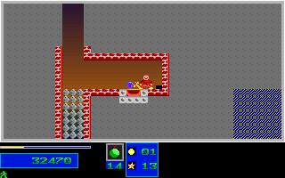
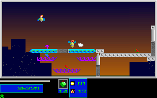

# Natural Level 3 Portal Return

## Scope

This recovers a portal activation defect found on an ordinary-input campaign
route. The unchanged 5258-tick three-pickup prefix is followed by 970 gameplay
frames through the lower shaft, three further objectives, and a portal return.
The initial Level 1 seed, reserve lives, assets and earlier route remain pinned.
There are no new gameplay-state injections. All original and C++ launches use
`SDL_AUDIODRIVER=dummy`; physical keyboard, audible playback and wall-clock
timing are not claimed.

The full 6228-tick route matches **5201 complete RGB frames, 10326 mapped
boundaries and 332864000 pixels**. New fixture coverage is 970 frames and
1940 boundaries. The Level 1 results reference remains the existing historical
native fixture, not a newly sampled Level 1 result stream.

Additional pickups occur at ticks 5933, 5935 and 5937. At tick 6109 the original
teleports P1 from `(734,376)` to `(392,120)`, preserving velocity `(0,0)` and
fractional carries `(187,219)`. The endpoint is `(392,128)`, six objectives,
57 destroyed structures, 100 health, one reserve, score 36220 and inventory
`[200,14,0,0,1]`. The seven-objective/20-percent completion gate is not reached.
The endpoint player is in native state two, with its delayed reserve drain
still pending. The raw health value of 100 is not a claim of active-player
healing or successful re-entry.

## Recovered Behavior

The original Down callsite at `1000:68e2` checks the cached floor tile `0x45`
and invokes `1000:5999`. Its floor column is `(x+4)>>3` and its floor row is
`(y>>3)+2`. The port instead sampled a body point after motion, so its earlier
route remained at `(734,376)`. The first mapped difference is precisely tick
6109 `post_update`. The failed replay, report and all raw bytes are retained.

The helper clears both physical Down banks (`DS:1b7c` and `DS:1b81`) before
destination lookup, changes motion-local coordinates without clearing velocity
or fractional carries, and requests sound cursor `0x001a` at priority four.
It does not impose the port's invented thirty-tick portal cooldown.

On successful shared-pool allocation it creates a separate kind-`0x0b`, mode-five
arrival marker with zero velocity, timer eight, and animation `0x4a..0x4f`, delay
two, mode one. The production marker path now advances this animation while
retaining the previous launch-pad marker behavior. Diagnostic cooldown output
remains available but correctly reports zero. The key-consumption state is
rearmed by release or a fresh physical key-down, including repeat events.
The two physical Down banks remain independent even for the port's one-player
arrow-key convenience alias. Repeating and then releasing one alias cannot
re-expose the other consumed held key.

The committed disassembly was produced from the pinned executable using its
MZ image file offset `0x770`. File addresses are not runtime segment addresses.
The natural one-player route establishes the portal and visible arrival path;
full natural two-player trajectories and actor-pool saturation remain outside
this fixture's acceptance scope.

## Native Provenance

The silent original capture contains 2452 Level 3 frames. Stream SHA256:
`6a1ed9310639a39ca067ead99f7de218bbc3d324df5d4f4bbddae4c4013d6581`.
All observer patches were restored. Its preceding 2132 Level 3 frames agree
with the separately retained lower-shaft capture in mapped state at every
sampled phase and in every RGB frame. The earlier 6088-tick six-pickup route independently matches
5061 full RGB frames and 10046 mapped boundaries without teleporting.

The native-only packer pins twelve producer/controller/journal/audit files,
all captured-file hashes, original assets and canonical Level 1 fingerprint.
It checks fresh mapped/RGB Level 2 and earlier Level 3 samples, frozen Level 2
results, complete native phase sequences, full map planes, observed palettes,
decoded RGB deltas and every declared input-bank write. Expected values never
come from the C++ replay.

Full native and failed/successful baseline bytes are retained in
`refs/notes/qa-natural-level3-20261005-lower-objectives-native-and-baselines-raw`:

- Anchor: `423c35c6441ba0cf2a2831995aed96de26153ffd`.
- Notes commit: `594f8d7d4f093c8db8492d4e45838076537ab5d2`.
- Manifest blob: `713f3156e18f53eb6536d6b4700365cae5d26317`.
- Archive: 255390876 bytes, 6594 stored members, four pinned chunks.
- SHA256: `d65b52dd36e1f584b63d76f20cae3a0c1ef9c58b3a654415b5500291f27fe5f5`.

Every logical byte alias was independently compared before packaging. A fresh
remote fetch verified chunks, the complete archive and every stored member.
Only the two closed local baseline replay trees were then reclaimed. The
misaligned C++-only portal pilot is separately retained, with no original-parity
claim. Small producer copies, comparison reports and screenshots are committed.

## Regression And Validation

- `natural_level3_portal_original` replays the complete route through the normal
  production loop and compares every covered frame and mapped boundary.
- `natural_level3_portal_guard` rejects thirty semantic/fixture mutations,
  twelve untrusted producers before output creation, and 291 typed/map/palette
  changes. Portal destination/carry, pickup timing, endpoint and bounded claims
  are guarded independently of byte fingerprints.
- Fourteen focused portal, launch-marker and physical-key tests passed locally.
  Fourteen further registered portal/guard and completion/fidelity guardrail
  tests passed in 178.70 seconds, including the full production replay. The
  corrected closed full replay also passed the native comparison. Exact-head
  CI, review, release and own-package acceptance are separate delivery gates,
  recorded in the pull request rather than inferred from a local build.
- `portal_down_key_banks` exercises both repeat/release alias orders, fresh
  makes and separate two-player banks through queued SDL events and the original
  portal constructor. The convenience-alias checks are adapter regressions,
  not a new original physical-keyboard or whole-campaign parity claim.

Mapped scope remains P1 coordinates, velocity/carries, animation, energy,
reserve, inventory and reels; P2 inventory; level/progress/HUD/score/RNG/red
phase; full tile/word hashes; and the existing 217 stored palette entries.
Not every actor field or all 256 DAC entries are compared. RGB comparisons are
always full 320x200 frames, including pixels outside the mapped palette subset.

## Screenshots

After the sixth objective, tick 6088:

After the portal return, tick 6228:

Each committed checkpoint pair has zero differing RGB pixels. Level 3
completion, later campaigns, all-actor state, manual/timing/audio acceptance
and whole-game parity remain unverified. All four broad OPEN items and global
functional-completion/fidelity flags stay unchanged.
