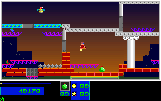
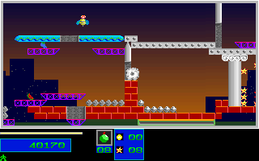
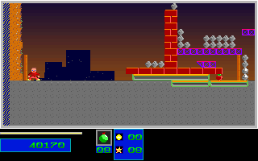

# Natural Level 3 Return and Ammunition HUD

## Scope

The 7065-tick ordinary-input route completes Levels 1 and 2, reaches eight
Level 3 objectives and 93 of the required 148 destroyed structures, then loses
one reserve and reenters. It does not complete Level 3. The old portal and
portal-escape fixtures remain unchanged.

The new native-derived fixture contains 711 RGB frames and 1422 mapped
present/post boundaries from ticks 6355 through 7065. Its full SDL production
replay checks 6038 RGB frames, 12000 mapped boundaries and 386432000 pixels,
including the earlier campaign, results and acknowledgment/intro prefix.
All 1422 added actor-mode, unsigned-countdown and global-player-state boundaries
are also compared. No C++ output generates expected data. No position, health,
reserve, inventory or progression was injected. All launches use dummy audio.

## Recovered Rule

The old port first differed at tick 6783: the original retained `08`, while
the port repainted the live refill count `10`. There were 42 differing pixels
in each of 283 frames through tick 7065; mapped state and lifecycle matched.
The unchanged full-frame comparator rejected that run, which remains retained.

Original `7C49..7C74` invokes `326E` only for global player state one and a
nonzero dirty byte at `DS:1B75 + player` (`DS:1B76` for player one).
`32AB` refreshes the icon only when the unsigned dirty byte exceeds one;
both dirty values refresh the selected inventory's count. `3327` clears the
byte and `332C` clamps the sampled unsigned count byte to 99. A count-only
update can retain a different painted icon, so the panel stores these values
independently from live inventory.

Level initialization (`2E49/2E4E`) writes two to both dirty bytes. Weapon
cycling (`6859`) writes two. Successful bomb placement (`6CA4`) and yellow/
green bomb rewards (`6EE0/6F5C`) write one, including replacement of a pending
two. The minimum-inventory refill (`7D2A..7D78`) does not dirty the panel.
Sampling stays before refill and the player fire/switch pass. Rendering stays
read-only, and snapshot/restore retains the independently painted icon/count.

## Native Checkpoints

| Tick | Position | Energy | Reserve | Medium | Actor Mode | Countdown Word | Global State |
| --- | --- | --- | --- | --- | --- | --- | --- |
| 6580 | 574,211 | 19 | 1 | 11 | 0 | 65514 | 1 |
| 6710 | 468,183 | 3 | 1 | 9 | 0 | 65514 | 1 |
| 6716 | 481,186 | 100 | 1 | 8 | 2 | 60 | 1 |
| 6776 | 64,272 | 100 | 0 | 10 | 2 | 0 | 2 |
| 6781 | 64,272 | 100 | 0 | 10 | 0 | 65531 | 1 |
| 7065 | 30,272 | 100 | 0 | 10 | 0 | 65531 | 1 |

The native dirty byte is zero at each checkpoint and throughout the refill/
return suffix. The panel retains `08` at the endpoint despite live Medium
inventory ten. These are actual paired original/changed-port frames with zero
pixel differences, not native-Windows/manual/package acceptance by themselves.

| Tick | Original | C++ |
| --- | --- | --- |
| 6710 |  |  |
| 6776 |  |  |
| 7065 |  |  |

## Provenance and Guards

`tools/natural_level3_return.py` pins the original stream
`410cd2e6d79991a41f1e3e4e585b7399321aed4f60f17a8176a5ec23bcc361b0`,
route, packed reference, typed guard input, fourteen instruction windows and
twelve compressed producer/configuration/journal/manifest files. Packing
checks all captured-file and shipped-asset hashes, every native input-bank
write, RGB delta, phase and map extent, and the immutable mapped/RGB prefix.
Instrumentation restoration is required. The native capture audit independently
checks 2804 unchanged Level 3 frames and 8412 pre/rendered/post boundaries
through tick 6580 against its previous healthy-fork capture.

Raw capture reconstruction uses
`refs/notes/qa-natural-level3-20261005-return-c16b34d-research-raw` and its two
`-part-NNN` refs at `c16b34d59deb4d90736f235634678b84b6b91ef2`.
Archive SHA-256:
`f1423093c5fc0c25e38bf65e80729b41f5588342290c88c0d0b22f6c08f9121f`.
`return-source-inventory.json`, logical label `return-original`, records all
path/member/hash aliases. All 2662 members and complete archive/chunk bytes
were independently read back and checked, then rechecked during restoration.
`native-provenance.json` retains those exact refs and verification details.

The guard rejects 84 semantic/fixture mutations, twelve producer mutations
before output creation, 291 typed state/map/palette mutations, four lifecycle
mutations and fourteen original-instruction mutations. It also checks countdown
word wrap. Unit coverage checks clean refill retention, count-only versus icon
updates, pending dirtiness in inactive states, unsigned bytes, player ownership,
level reset, snapshot restore and repeated-render purity.

```sh
env SDL_AUDIODRIVER=dummy ctest --test-dir build --output-on-failure \
  -R '^natural_level3_return_(original|guard)$'
python3 -S -B tools/natural_level3_return.py pack \
  --capture /path/to/restored/native --out /path/to/fresh/fixture
```

## Limits

Level 3 completion, later natural campaigns, natural two-player/pool saturation,
all actor fields, excluded DAC entries, manual input, audible output and
wall-clock fidelity remain unverified. The native HUD dirty byte is retained
as provenance and covered by instruction/unit/full-frame checks, not directly
compared against a newly expanded C++ trace schema. No broad OPEN item or global
completion/fidelity flag is promoted.
