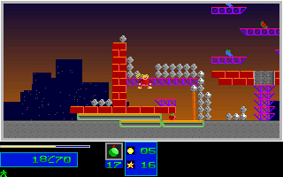
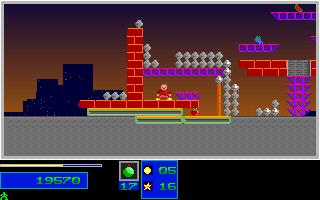

# Natural Level 3 Second Objective Regression

## Scope

This promotes the original-verified second Level 3 pickup to a self-contained
production regression. It adds 320 ordinary movement/jump frames after the
unchanged 4438-tick Level 1/2 completion, Level 3 entry and first-pickup route.
There is no extra bomb, gameplay-state injection or gameplay implementation
change. The initial seed is the existing canonical Level 1 seed. Normalized
control-bank inputs drive gameplay; separately verified fresh BIOS Return
inputs acknowledge results and intros. Physical keyboard, audio and wall-clock
timing are not claimed.

The complete 4758-tick replay compares **3731 full RGB frames, 7386 mapped
boundaries and 238784000 pixels**. The extension contributes **320 frames and
640 mapped boundaries**. The Level 1 result-reel reference remains the
registered historical native fixture, not a newly sampled reel stream.

The second objective is collected at C++ tick 4674 / native Level 3 sample 897.
The endpoint has two objectives, 36 destroyed structures, P1 `(229,256)`,
62 health, one reserve, score 19570 and inventory `[200,17,0,0,1]`. The required
seven-objective/20-percent Level 3 completion gate is not reached.

## Native Provenance

The silent original observer recorded 982 Level 3 frames: 12 entry frames,
650 first-pickup frames and this 320-frame extension. Stream SHA256:
`54dad8dd40aaf54913568ea849c722faf9ba59d796f396603dea113cffd1c048`.
All observer hooks were restored. Failed exploration attempts remain distinct
from the passing no-extra-bomb capture.

The native-only packer checks fourteen pinned producer/controller/journal
files before creating output, every captured-file hash, unchanged original
assets/executable, canonical Level 1 input, fresh mapped/RGB Level 2 and Level 3
prefix samples, frozen Level 2 results, BIOS queue acknowledgments, complete
frame/phase sequences, 9000-byte tile and 18000-byte word planes, all three
observed palettes, decoded RGB deltas and every input-bank write. Runtime
variant configuration explicitly pins the 982-frame extent and unchanged
662-frame earlier Level 3 prefix. It does not accept C++ data as expected values.

Source/controller copies and audits are committed compressed beside the
screenshots. Full raw streams, source files, journals, logs and preview proofs
are retained remotely through these independently readback-verified archives:

- `refs/notes/qa-natural-level3-20261005-next-pickup`: notes commit
  `6eb4e261cbfb4bfc53117d8d0d22417e853087c8`, 853 stored members, 129003274 bytes,
  archive SHA256 `a0e614765ebb1c2b43c16ff62ee5e8a4053c526ebfdaf0b3b0854097b7ce9f43`.
- `refs/notes/qa-natural-level3-20261005-continuation`: notes commit
  `2378a433d53c0e072385c8c2703dd88293b1ba6f`, 6553 stored members, 175991914 bytes,
  archive SHA256 `b3914f91dbba1763a73cb2a96832fe56108515b0d87012878b1527341075264c`.

Both notes are anchored on `9f6367ae72a061393d2312c90bc0766af0093fdb`. The
continuation archive supplies byte aliases recorded in the next-pickup
inventory. Restoration checks pinned note/manifest objects, archive/chunk
bytes, safe member names and each logical file's size/SHA256. All 1041 native
capture filenames were reconstructed and verified before fixture production.

## Regression And Guards

- `natural_level3_second_objective_original` compares the complete campaign,
  entry, first pickup and second-pickup extension through the production loop.
- `natural_level3_second_objective_guard` rejects 20 semantic/fixture mutations,
  fourteen producer mutations before output creation and 291 typed/map/palette
  changes. Native-only positive projection and excluded-DAC negative controls
  are required.
- Existing `natural_campaign` and `natural_level3_objective` replay/guard pairs
  retain their own fixtures, registrations and coverage contracts.

Mapped scope covers P1 coordinates, velocity/fractions, animation, energy,
reserve, inventory and reels; P2 inventory; level, progress, HUD, score, RNG,
red phase; full tile/word hashes; and 217 stored palette entries. Every compared
presentation is the entire 320x200 RGB frame. Raw actor/spawner bytes are
retained, but not every actor field is compared. Palette entries 176..214 are
excluded from mapped scope, not from whole-frame RGB comparison.

## Local Validation

A fresh Release build from this working tree passed the six focused Linux
campaign/first-pickup/second-pickup replay and guard tests in 374.50 seconds.
All seven completion-status and runtime/visual claim guardrail tests passed.
Native Windows passed the second-pickup guard and complete 3731-frame,
7386-boundary replay, using the unchanged PR #281 release executable SHA256
`4e8e6c917e232ac7f812d60a880fe7a9a2a9531dea94ec32becc7b216dcc16c5`
with repository assets. That local Windows replay is not acceptance of this
batch's exact-head package or its own asset directory; CI/release delivery and
fresh package checks are recorded separately in the pull request.

## Screenshots

Immediately after pickup, native sample 898 / C++ tick 4675:

Endpoint, native sample 981 / C++ tick 4758:

The three committed checkpoint pairs (ticks 4675, 4676 and 4758) each have zero
differing RGB pixels. These previews derive from the original capture and its
verified Linux comparison; platform/package acceptance is recorded separately
in the pull request.

## Limits

This is a bounded ordinary route, not Level 3 completion, later campaigns,
all actor fields, manual input/timing, audio timing, natural Level 7 victory or
whole-game parity. No broad OPEN item or global completion/fidelity flag
changes. Passing-test counts are not an overall recovery percentage.
