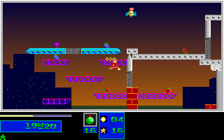
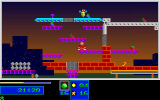

# Natural Level 3 Third Objective Regression

## Scope

This promotes the original-verified third Level 3 pickup to a self-contained
production regression. It adds 500 ordinary movement/jump frames and one Medium
bomb after the unchanged 4758-tick Level 1/2 completion, Level 3 entry and
first/second-pickup route. No gameplay implementation changes or new gameplay
state injections are introduced. The initial seed remains the canonical
Level 1 seed. Normalized control-bank inputs drive gameplay; separately
verified fresh BIOS Return inputs acknowledge results and intros. Physical
keyboard, audio and wall-clock timing are not claimed.

The complete 5258-tick replay compares **4231 full RGB frames, 8386 mapped
boundaries and 270784000 pixels**. The extension contributes **500 frames and
1000 mapped boundaries**. The Level 1 results reference remains the registered
historical native fixture, not a newly sampled Level 1 reel stream.

The third objective is collected at C++ tick 5092 / native sample 1315. The
endpoint has three objectives, 36 destroyed structures, P1 `(383,192)`,
46 health, one reserve, score 21120 and inventory `[200,16,0,0,1]`. The required
seven-objective/20-percent Level 3 completion gate is not reached.

## Native Provenance

The silent original observer recorded 1482 Level 3 frames: the earlier 982
frames plus this 500-frame extension. Stream SHA256:
`a59a3f4598a82f213f06656093c384916fd47d027b0b92ec359d5280a9a311f9`.
All observer hooks were restored. The earlier missed-pickup exploration is
C++-only, not oracle evidence. The first native setup failed before capture
creation because the producer requires a literal child of `/dev/shm`; the
driver output path was corrected without weakening any guard. Both drivers
and the failed setup log remain retained.

The native-only packer checks twelve pinned producer/controller/journal files
before output creation, every captured-file hash, unchanged assets/executable,
canonical Level 1 input, fresh mapped/RGB Level 2 and earlier Level 3 samples,
frozen Level 2 results, BIOS queue acknowledgments, complete frame/phase
sequences, 9000-byte tile and 18000-byte word planes, all three observed
palettes, decoded RGB deltas and every input-bank write. The runtime variant
explicitly pins the 1482-frame extent and unchanged 982-frame prefix. It does
not accept C++ output as expected values.

Compressed source/controller copies and audits are committed beside the
screenshots. Full raw streams and logical inventories are retained in
`refs/notes/qa-natural-level3-20261005-second-objective-regression`:

- Anchor: `1b5fd909b4b9750da90530420de1265ef0864167`.
- Notes commit: `8281657f70b7f1d97354d72e024b71b9ef309142`.
- Manifest blob: `91e5642a71bc8ffd869af52f822b4b0df0c34d9b`.
- Archive: 357849774 bytes, 5232 stored members, six pinned chunks.
- Archive SHA256: `810c5cfb715ca51d8f7b70a7a2ca248c665d202cacec45288e96d2774d02b1e7`.

Independent restoration verified note/manifest objects, chunk/archive bytes,
safe member names and all 5232 stored members. All 1539 logical native filenames
were reconstructed from the same archive's byte aliases and individually
size/SHA256 verified. The committed restoration proof records those checks.

## Regression And Guards

- `natural_level3_third_objective_original` compares the complete campaign,
  entry and all three pickups through the production loop.
- `natural_level3_third_objective_guard` rejects 22 semantic/fixture mutations,
  twelve producer mutations before output creation and 291 typed/map/palette
  changes. Native-only positive projection and excluded-DAC negative controls
  are required. Reordered boundaries and a changed final score are rejected.
- Existing campaign, first-pickup and second-pickup replay/guard pairs retain
  their own unchanged fixtures, registrations and coverage contracts.

Mapped scope covers P1 coordinates, velocity/fractions, animation, energy,
reserve, inventory and reels; P2 inventory; level, progress, HUD, score, RNG,
red phase; full tile/word hashes; and 217 stored palette entries. Each compared
presentation is the entire 320x200 RGB frame. Raw actor/spawner bytes remain
retained, but not every actor field is compared. Palette entries 176..214 are
excluded from mapped scope, not from whole-frame RGB comparison.

## Local Validation

A fresh Release build from this working tree passed all eight focused Linux
campaign/first-pickup/second-pickup/third-pickup replay and guard tests in 544.18
seconds. Ten completion-status and visual-claim guardrail tests passed. Native
Windows passed the third-pickup guard and full 4231-frame, 8386-boundary replay,
using the unchanged PR #282 release executable SHA256
`c9a75f589a32dd65d82de561130ad043beab39f2a0e74d726de9271e106a2426`
with repository assets. That local Windows replay is not acceptance of this
batch's exact-head package or its own asset directory. Exact-head CI, review,
release and own-package acceptance remain separate delivery gates recorded in
the pull request.

## Screenshots

Immediately after pickup, native sample 1316 / C++ tick 5093:

Endpoint, native sample 1481 / C++ tick 5258:

The three committed checkpoint pairs (ticks 5093, 5094 and 5258) each have zero
differing RGB pixels. Previews derive from the original capture and verified
Linux comparison; platform/package acceptance is recorded separately.

## Limits

This bounded ordinary route is not Level 3 completion, later campaigns,
all actor fields, manual input/timing, audio timing, natural Level 7 victory or
whole-game parity. No broad OPEN item or global completion/fidelity flag
changes. Passing-test counts are not an overall recovery percentage.
