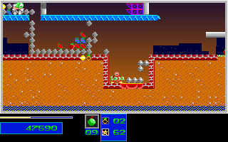

# Natural Level 4 First Objective

The unchanged ordinary one-player campaign prefix now reaches the first Level 4
objective in both the original game and the normal C++ production replay. This
does not complete Level 4 or increase the completed-level count beyond three
of seven. No aggregate reverse-engineering percentage is inferred.

## Observed Route

The pinned 9760-tick route executes from normal Level 1 startup, retaining the
previous Level 3 completion gate at tick 8905 and fresh Return acknowledgements
at ticks 9301 and 9421. The new Level 4 controls are ordinary movement, jump,
weapon/fire and Down keys. There are no per-tick gameplay-state injections.
All original and C++ processes use dummy audio.

At tick 9680 post-update the original collects its first objective at
`x=603, y=400`, with 42 health, zero reserves, nine Medium bombs and score 47590.
It has destroyed 29 structures at that boundary. The tick-9760 endpoint retains
the objective, nine Medium bombs and score 47590, with 38 health and 105 destroyed
structures. This route has not met the three-objective/305-structure requirement.

## Comparison Scope

- 400 full 320x200 RGB frames match: the gate presentation, 58 result-loop
  presentations, results acknowledgement, Level 4 intro, and 339 playable
  Level 4 presentations through tick 9760. This is 25,600,000 compared pixels.
- 740 mapped boundaries match, including lifecycle, covered monster/marker
  projections, full map-plane fingerprints and covered palette fields.
- 737 applicable boundaries additionally compare raw-DS-derived terrain state.
- All 1078 newly retained pre/present/post, result and handoff DS snapshots pass
  an independent coherence audit with zero differing projected bytes and zero
  normalization. Each observation uses one stopped atomic DS snapshot.
- The fresh original repeats the pinned 5129-frame Level 3 prefix and its three
  mapped phases before the new window. This is repeated native evidence, not
  a claim of a new full-prefix C++ comparison.
- The 339-frame Level 4 window includes the previously covered 29 entry frames;
  it extends that window by 310 gameplay frames.

The expectations in `tests/fixtures/natural_level4_first_objective` come only
from the closed original capture. The C++ trace is comparison evidence, never
an expectation source. The pinned manifest preserves 23 producer/control
artifacts, including capture, atomic decoder, audits, actual terminal receipts
and independently read-back raw/closed-control retention proofs.

The complete raw archive contains 5804 unique members, SHA-256
`2b0b47077759abb3739118a1082789bc256ef4187a4cca9dde7d7b6028e57916`.
Its Git notes reference is
`refs/notes/qa-natural-level3-20261005-level4-first-objective-native-comparison-20261007-raw`,
anchored to producer revision `4fe016ad7bfce8ab41f70301b22e7216067df3e5`.
The separately retained actual closed controls have SHA-256
`39c6bfcd57a129f47e6c9b6efa6ec12420b2576261a59a3f9dd1fe5b682a325e`.
Raw archive aliases are independently checked against their declared hashes.
The raw snapshot includes an in-progress current-main build receipt; the final
build receipt and actual keeper closure are preserved in the closed controls.

## Regression

```sh
env SDL_AUDIODRIVER=dummy ctest --test-dir build --output-on-failure \
  -R '^(natural_level3_handoff|natural_level4_first_objective)_(original|guard)$'
```

The new replay compares 400 RGB frames and 740 boundaries and rejects 43 C++
projection mutations. Its guard rejects 19 semantic/fixture mutations,
23 producer mutations and 291 typed/map/palette mutations. The prior handoff
test keeps its original defaults and fixture. The shared comparison also
rejects skipped non-player phases outside actual intro/results waits.

Original at tick 9700:



C++ at the same verified presentation boundary:


## Remaining Limits

Level 4 completion, Levels 5-7 campaign completion, whole actor/clock/sound-byte
equivalence, physical presentation timing and broader two-player routes remain
open. Later C++-only portal/escape attempts are separate exploratory evidence
and are not promoted by this fixture. All broad completion/fidelity flags stay
false. Runtime comparison does not substitute for exact-head Linux/Windows
full-suite and package validation before merging.
