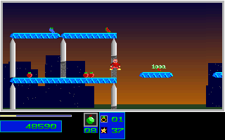

# Natural Level 4 Portal And Second Objective

The ordinary one-player route now has permanent original-backed coverage through
the Level 4 portal and second objective. Levels 1-3 remain the only completed
campaign levels established by this route. No aggregate reverse-engineering
percentage or Level 4 completion claim is inferred.

## Observed Route

The 10720-tick production replay starts from Level 1 using ordinary SDL input,
without per-tick state injections. Its prefix agrees with the retained first
Level 4 objective route through tick 9760. Both games use dummy audio.

The first objective remains at tick 9680. At tick 10633, the original travels
from `x=620, y=400` to `x=394, y=80`, with 22 health, zero reserves, eight Medium
bombs and score 47590. The regression pins both presentation and post-update
position, velocity and fractional carries; these are observed boundaries,
not a claim that all velocity components remain unchanged through integration.

The second objective is collected at tick 10662 post-update, at `x=324, y=174`,
with 22 health, eight Medium bombs, 144 destroyed structures and score 48590.
The endpoint at tick 10720 is `x=211, y=184`, score 48990, still with 22 health,
two objectives and 144 destroyed structures. The required three objectives
and 305 destroyed structures have not been reached.

## Evidence

- 1360 complete 320x200 RGB presentations compare exactly: the gate, 58 result
  presentations, two acknowledgement/intro presentations, and 1299 Level 4 frames.
  This represents 87,040,000 compared pixels.
- 2660 mapped boundaries compare lifecycle, covered monster/marker projections,
  map-plane fingerprints and covered palette fields. The 2657 applicable
  boundaries also include raw-DS-derived terrain projections.
- 3958 atomic original DS snapshots pass the independent coherence audit with
  zero differing projected bytes and zero normalized bytes.
- The original repeats 5129 Level 3 gameplay frames before the new window.
  This is repeated native evidence, not a new full-prefix C++ comparison.
- Capture processes, their display and the owned keeper are terminal before
  reference packing. The evidence manifest pins 27 producer/control artifacts.

Expected bytes in `tests/fixtures/natural_level4_portal` come exclusively from
the closed original capture. C++ observations are never used to construct
expectations. The pinned evidence includes launch-time producers, the atomic
decoder, independent audit, terminal receipts and closed-service proof.

The full native and exploratory archive has 7796 members and SHA-256
`130161243172fc7a819fc07cb96048347733d797993a7aa41a66ccf892aac75d`.
It is retained under Git notes reference
`refs/notes/qa-natural-level3-20261005-level4-portal-second-native-and-third-candidate-20261007-raw`,
anchored to producer `4fe016ad7bfce8ab41f70301b22e7216067df3e5`.
All member sizes/hashes, the complete archive and note anchors were verified
after independent remote readback. Unique raw captures and failed scouts remain
preserved; redundant RAM transfer copies are not original capture evidence.

## Regression

```sh
env SDL_AUDIODRIVER=dummy ctest --test-dir build --output-on-failure \
  -R '^(natural_level4_(first_objective|portal)_(original|guard)|natural_level4_checkout_attributes)$'
```

The new replay rejects 43 C++ projection mutations. The separate guard rejects
23 semantic/fixture mutations, 27 producer mutations and 291 typed/map/palette
mutations, including changed portal position, velocity, fractional carry and
second-pickup timing. Both the old and new fixtures are protected from Windows
newline conversion and exercised by a real autocrlf-enabled Git checkout test.

Original game, tick 10675:


C++ at the same verified presentation boundary:



## Remaining Limits

Level 4 completion, Levels 5-7 campaign completion, full actor/clock/sound-byte
equivalence, physical timing and broad two-player behavior remain unverified.
Later C++-only third-pickup and demolition scouts are not promoted by this
fixture. All broad completion/fidelity flags remain false. Exact-head full
Linux/Windows tests and both package jobs are still required before merging.
