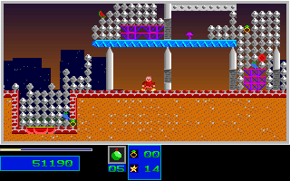

# Natural Level 4 Third Objective And Return Portal

The ordinary one-player route now has permanent original-backed coverage through
the third objective and return portal. It does not establish Level 4 completion:
the endpoint has all three objectives but only 244 of 305 required destroyed
structures. Levels 1-3 remain the only completed campaign levels on this route.
No aggregate reverse-engineering percentage is inferred.

## Observed Route

The 11420-tick production replay starts from Level 1 with ordinary SDL input,
without per-tick state injections. Its prefix agrees with the retained portal
and second-objective route through tick 10720. All runs use dummy audio.

The objectives occur at post-update ticks 9680, 10662 and 11286. The first portal
is at tick 10633. At tick 11286 presentation, the original still has two
objectives, 209 destroyed structures and score 50190, at `x=170, y=405`.
The post-update observation has three objectives, 230 destroyed structures and
score 51190, at `x=170, y=398`. It retains 22 health, zero reserves, 200 Small
and five Medium bombs. The fixture pins both boundaries rather than treating
the pickup-tick screenshot as an already updated objective count.

At tick 11301 presentation, the player is at `x=146, y=400` with velocity
`[-790,448]` and fractional carries `[55,132]`. After the return portal and
ordinary integration, the player is at `x=266, y=344` with velocity `[374,0]`
and carries `[173,132]`. Destruction credit rises from 230 to 237 in that update.
The tick 11420 endpoint is `x=271, y=360`, score 51190, still with 22 health,
three objectives, five Medium bombs and 244 destroyed structures.

## Evidence

- 2060 complete 320x200 presentations compare exactly: the gate, 58 results,
  two acknowledgement/intro presentations and 1999 Level 4 gameplay frames.
  This is 131,840,000 compared pixels.
- 4060 mapped boundaries compare lifecycle, covered monster/marker projections,
  map-plane fingerprints and covered palette fields. The 4057 applicable
  boundaries also compare terrain decoded from raw original DS bytes.
- 6058 atomic original DS snapshots pass independent coherence checks, with
  zero differing projected bytes and zero normalized bytes.
- The original repeats 5129 Level 3 gameplay frames before this window. That
  repeated native prefix is not a new full-prefix C++ comparison.
- Owned capture, display and keeper processes are terminal before packing.
  The manifest pins 26 producer/control artifacts, including actual terminal
  receipts, independent audit, closed-process proof and the native-only packer.

Expected bytes in `tests/fixtures/natural_level4_third_objective` are derived
only from the closed original capture. C++ observations are not used to generate
expectations. The existing first-objective and portal fixtures remain unchanged.

The complete raw archive has 10017 members and SHA-256
`70c6409116aa9fd705d775e4683df9dd2bfa268f292694ec93012d60b38e70a1`.
Git notes retain it at
`refs/notes/qa-natural-level3-20261005-level4-healthy-third-objective-native-comparison-20261007-raw`,
anchored to producer `4fe016ad7bfce8ab41f70301b22e7216067df3e5`.
All member sizes/hashes, the whole archive and note anchors were verified after
independent remote readback. Unique raw captures and failed candidates remain
preserved. Closed, identical frame bytes may share storage without removing
any evidence path; redundant verified transfer copies are not unique captures.

## Regression

```sh
env SDL_AUDIODRIVER=dummy ctest --test-dir build --output-on-failure \
  -R '^(natural_level4_third_objective_(original|guard)|natural_level4_checkout_attributes)$'
```

The replay rejects 43 C++ projection mutations. The guard rejects 26
semantic/fixture mutations, 26 producer mutations and 291 typed/map/palette
mutations. These include premature third-objective credit, changed pickup
velocity/carries and changed return-portal position, velocity and carries.
An actual autocrlf-enabled Git checkout checks all three Level 4 fixture and
evidence sets, with an unpinned negative control that reproduces byte changes.

Original game after the return portal, tick 11420:


C++ at the same compared presentation boundary:



## Remaining Limits

There are still 61 required structures before Level 4 can complete. Later
demolition candidates are C++-only unless separately compared with the original.
Levels 5-7 campaign completion, full actor/clock/sound-byte equivalence, physical
timing and natural two-player behavior remain unverified. Broad completion and
fidelity flags stay false. Exact-head full Linux/Windows tests and both package
jobs are required before merging.
