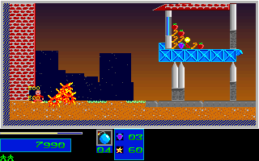

# Pickup Indicator Origin After Landing

The longer ordinary-input Level 2 route exposed a two-pixel pickup-label
offset after a large-bomb explosion. The original and the port agreed at
all 1,200 mapped rendered/post-update boundaries, but 24 of the 600 full
320x200 frames differed by 102 pixels each. The first difference was native
frame 686, host replay tick 1111, extension sample 368. The initial failing
capture and comparison are retained; this is not a passing baseline.

## Original Instructions And State

Read-only disassembly of the unchanged `LEZAC.EXE` confirms:

- `1000:6743..675F`, file `0x6EB3..6ECF`, handles gravity/landing before
  player input. A grounded positive VY then masks local Y with `0xFFF8` at
  `1000:675F..6765`, file `0x6ECF..6ED5`.
- The fire constructor consumes local X/Y at `1000:6C25..6C28`, file
  `0x7395..7398`, before the four-cell pickup loop at `1000:6CB8`.
- The pickup constructor reads local X/Y at `1000:6D98` and `1000:6DAB`,
  file `0x7508` and `0x751B`, adding the signed per-cell -2/+10 offsets.
  The tile footprint was cached earlier; it is not recomputed from snapped Y.

At native frame 685, the pre-update player visual is `(33,370)`, VY is 560,
and the player is landing above the floor. Local Y snaps to 368. The two
new indicators therefore begin at `(31,366)` and `(31,378)`, not `(31,368)`
and `(31,380)`. Their VY values are -216 and -190, timer 12, behavior 5,
kind `0x0A`, and hotspot 11. The two creation RNG draws advance
`3181139540 -> 2565739066`.

The port now performs pickup handling inside the active-player update after
fire and before terrain damage/integration, passing the local origin while
retaining the cached four-cell scan. Explicit pickup-only diagnostic callers
retain their visual-position origin.

## Native Capture And Scope

The native run uses the unchanged natural Level 1 completion/results/intro
handoff, then 600 continuous Level 2 gameplay frames, native frames 318..917.
Only normalized gameplay controls are written after the initial prefix seed;
no player position, health, reserve lives, inventory, objective, or map state
is reseeded. Temporary copies protect shipped assets. Audio is dummy in both
the original and C++ runs, and the capture confirms its hooks were restored.

- Original executable SHA-256:
  `7579255148c2cb540b26f70dc8181c50b218b6808d8fa5208c832391bafa53ec`.
- Native extension stream SHA-256:
  `b154ebd525e60f2a11e00b18a64f09f1f2f8321834d4da859e59b343e269b1ae`.
- Prefix canonical SHA-256:
  `18c029dcc107cf95b088a914cf60aa05fd30fbaf26501e3b2367ee91cd96ace8`.
- Private base observer SHA-256:
  `acb311ed85fb594afc1d92d6774036a742388339b920bcc0f81206cabfb30dec`.
- Private route controller SHA-256:
  `0f49ee8aad5436679466c94221994fce52ba535cbd7e083e8b9ca7004f2ee3a1`.

The full capture, copied producer/controller, event specification, route,
manifests, and corrected C++ replay remain in the RAM evidence workspace.
The corrected replay was also losslessly archived as
`/dev/shm/lezac-natural-level2-progress-cpp-20261001-v2.tar.gz`, SHA-256
`77f21dd03838b8dff356b4fd7f582f9a90fc9c701747ee14ce0bbaec19117ead`.
The initial C++ replay is retained losslessly in
`/dev/shm/lezac-natural-level2-progress-cpp-20261001-v1.tar.gz`, SHA-256
`44fad6d5bad12ba06c675f0c2ddb1d648d5655346b9bbfad0210b39447f9bd9a`.
Its verification record preserves every raw file size/hash. Only the
byte-verified redundant directory was removed; native and failing comparison
evidence were not deleted. These volatile artifacts must be preserved before
any WSL shutdown.

## Permanent Regression

The small [binary fixture](../../tests/fixtures/pickup_landing_original.bin)
contains the native entry pose, RNG seeds, descriptor table, a 5x5 local map
window and 26 consecutive post-update boundaries for these two indicators.
It is 2,798 bytes, SHA-256
`b272ab18f79ccd50223cd8a9fa15f50336b487e3950888441cdd82d05c5455d3`,
FNV-1a `cc9b3df95c102cc2`. The [extraction record](evidence/pickup_landing_2026-10-01/extraction.json)
retains all 48 raw actor/visual pairs and explicitly identifies the seeded
C++ probe. Its native source was continuous play, but the isolated regression
seeds the C++ pose/local map and advances only the indicator lifetimes.
It does not claim a complete native actor pool, world, or player replay.

`pickup_landing_original` checks creation, velocities, fractional carries,
timer/retirement, hotspot, animation and sprite descriptors. It validates the
fixture fingerprint before seeding. `transient_actor_limits` additionally
checks four synthetic local-origin cases: landing, airborne falling
response, hard-landing bounce and platform drop, preserving clockwise offsets,
allocation counts and RNG draws. Those four cases are model contracts.
`pickup_landing_guard` checks five truncated, trailing, altered-frame, altered-RNG
and altered-label fixtures. Each must fail before the seeded replay starts;
unique per-run diagnostics are retained.

## Comparison And Limits

The corrected exploratory run matches all 600 original frames:
38,400,000 RGB pixels and 1,200 mapped boundaries, with zero differences.
Mapped boundaries include active-player motion, health/reserves, inventory,
HUD/score/RNG, both full map planes and 217 stored DAC entries. The computed
backdrop ramp is excluded from stored-DAC comparison, while every displayed
RGB pixel remains compared. This private longer-route comparison is retained
separately from the registered small actor-lifetime regression.

The route reaches genuine spawns, pickups, two large bombs, player damage and
structural collapse. At its final boundary the player has energy 70, two
reserve lives, score 8990, and inventory `[200,20,3,0]`. Nine structures are
destroyed, and all four objective tiles remain. Level 2 requires three
objectives and 60% destruction, at least 236 of its denominator of 393.
This is not Level 2 completion, a natural campaign/boss finish, physical input
or wall-clock verification, all-actor/all-DAC fidelity, or whole-game acceptance.
The whole-game completion flags and absence of an overall percentage remain
unchanged.

Original and corrected C++ images at the first formerly failing boundary:

The compact before/after comparison reports and failing C++ image are retained
beside these images, together with byte-exact copies of the private controller,
base observer, extractor, native manifest and full input route. These copied
scripts record their original private execution paths, not a supported standalone
capture command in this evidence directory. Original-backed player motion/posture/animation/pickup
checks and the four origin cases pass locally; full exact-head CI is a separate
delivery gate, not implied by this local comparison.
